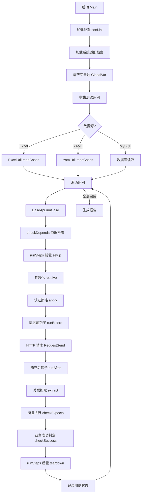
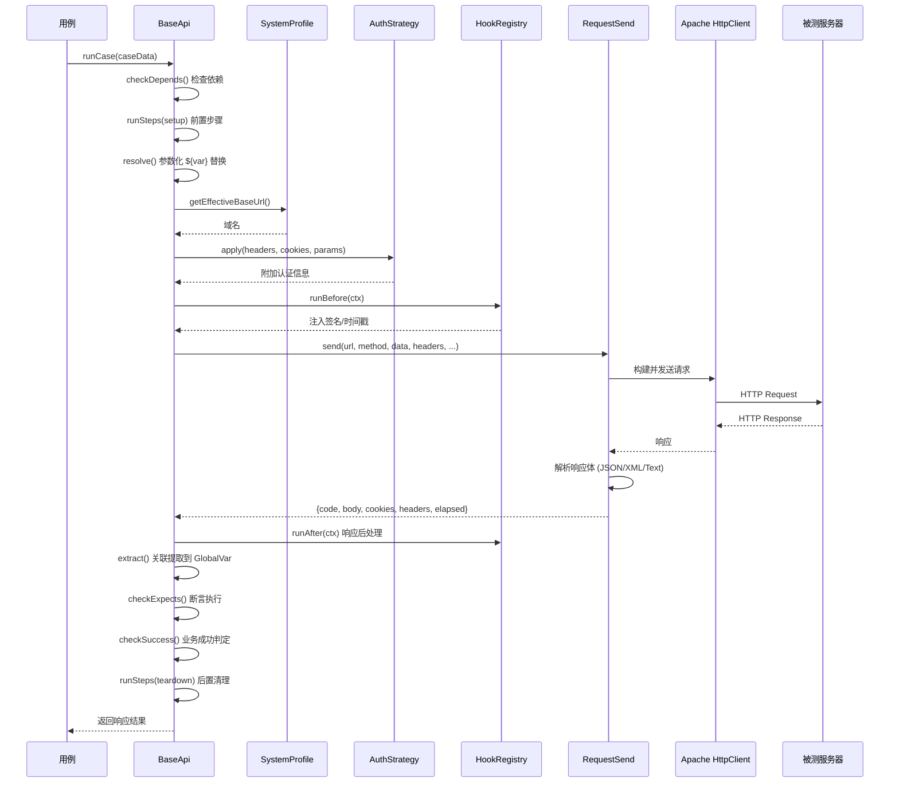

# 01 - 架构设计

## 一、整体架构

框架采用经典的 **分层架构**，从下到上分为 5 层：

```
┌─────────────────────────────────────────────────┐
│  用例层 (testcase)                               │
│  JUnit 5 DynamicTest 数据驱动                    │
├─────────────────────────────────────────────────┤
│  接口层 (api)                                    │
│  BaseApi + 自定义 API Object                     │
├─────────────────────────────────────────────────┤
│  公共层 (common)                                 │
│  参数化 / 认证 / 断言 / 钩子 / 响应判定 / 适配   │
├─────────────────────────────────────────────────┤
│  工具层 (utils)                                  │
│  HTTP / Excel / YAML / MySQL / 日志 / Allure     │
├─────────────────────────────────────────────────┤
│  配置层 (config)                                 │
│  Settings + IniParser + conf.ini + 系统档案      │
└─────────────────────────────────────────────────┘
```

**依赖方向**：上层依赖下层，下层不感知上层。

## 二、核心执行流程



## 三、一次请求的内部链路



## 四、核心模块职责

### 4.1 配置层 (config)

| 类 | 职责 |
|---|---|
| `Settings` | 全局配置中心，统一管理路径、运行开关、数据库、日志、报告、认证、CI |
| `IniParser` | INI 文件解析器，对齐 Python configparser 行为（保留大小写、不做插值） |

**配置优先级**：环境变量（`AMSAPI_*`） > `config/conf.ini` > 代码默认值

### 4.2 公共层 (common)

| 模块 | 职责 |
|---|---|
| `base/Base` | 参数化核心：`${var}` 查找替换、路径解析、XML 互转、安全 JSON 解析 |
| `variable/GlobalVar` | 全局变量池：接口间参数传递（线程安全） |
| `response/ResponseSpec` | 响应判定：6 种成功判定风格 |
| `auth/*` | 7 种认证策略 + 工厂 |
| `hooks/Hooks` | 请求/响应钩子 + 签名/时间戳/AES 工具 |
| `asserts/Asserts` | 21 种断言算子 |
| `profile/SystemProfile` | 系统适配档案加载与域名解析 |
| `exceptions/*` | 自定义异常 |

### 4.3 工具层 (utils)

| 类 | 职责 |
|---|---|
| `RequestSend` | Apache HttpClient 封装，统一请求/响应结构 |
| `ExcelUtil` | Excel 用例读写（Apache POI） |
| `YamlUtil` | YAML 用例读取（SnakeYAML） |
| `MysqlUtil` | MySQL 连接与执行（JDBC） |
| `LogUtil` | SLF4J + Logback 日志初始化 |
| `AllureUtil` | Allure 报告附件封装 |

### 4.4 接口层 (api)

| 类 | 职责 |
|---|---|
| `BaseApi` | 接口基类：URL 组装、参数化、认证、钩子、请求、关联、断言、生命周期 |
| `LoginApi` | 登录接口对象（示例） |
| `DictApi` | 字典接口对象（示例） |
| `AdminApi` | 管理端接口对象（示例） |

### 4.5 用例层 (testcase)

| 类 | 职责 |
|---|---|
| `TestExcelDriver` | Excel 数据驱动（JUnit 5 DynamicTest） |
| `TestYamlDriver` | YAML 数据驱动（JUnit 5 DynamicTest） |

## 五、数据流

### 5.1 参数关联数据流

```
用例 A: relation: ticket=body.data.ticket
    ↓ 执行后
GlobalVar.set("ticket", "abc123")
    ↓
用例 B: url: /v1/users/${ticket}/profile
    ↓ Base.replace()
/v1/users/abc123/profile
```

### 5.2 配置加载数据流

```
config/conf.ini ──┐
                  ├──→ Settings (静态初始化)
AMSAPI_* 环境变量 ─┘         │
                             ↓
                    SystemProfile.loadProfile()
                             │
                             ↓
                    config/systems/<name>.ini
                             │
                             ↓
                    ResponseSpec / AuthStrategy / HookRegistry
```

## 六、设计原则

1. **零硬编码**：所有可变数据（地址、账号、超时）全部走配置
2. **配置即代码**：系统差异通过 INI 档案声明，不改代码
3. **数据驱动**：用例与代码分离，测试人员无需写代码
4. **分层解耦**：上下层单向依赖，可独立测试各层
5. **线程安全**：变量池用锁保护，支持并发执行
